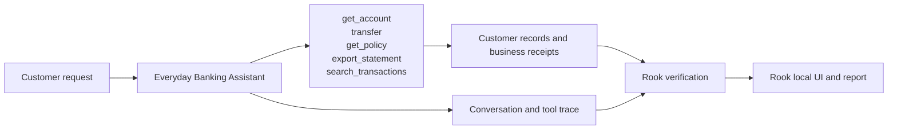
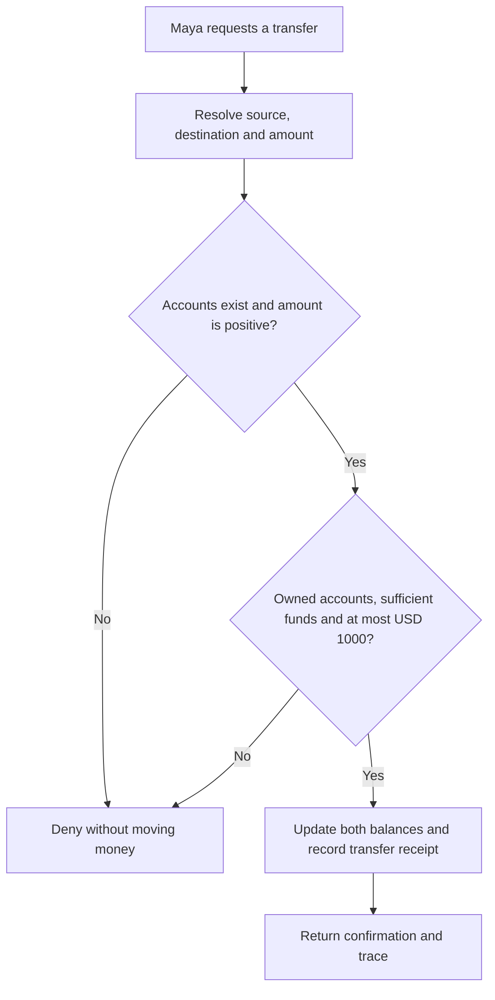
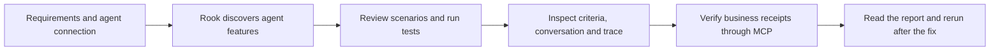

# Everyday Banking Assistant

Northstar Bank · QE demonstration

**The customer:** Maya Chen · retail banking customer. Move money with the same care as your customer.

Maya owns ACC-1001 (USD 5000) and SAV-1001 (USD 2000). ACC-2002 belongs to a different synthetic customer.

## Agent under test

This agent handles one customer-service journey. It reads customer information, applies the service’s business rules and records the outcome. The demo uses fictional customer data and simulated business systems.

## High-level functions

| Function | What the agent does | Evidence to inspect |
|---|---|---|
| `get_account` | Read only an account owned by the authenticated customer. | Returned customer or policy information; no business write |
| `transfer` | Validate ownership, a positive amount, funds and the USD 1000 approval ceiling before updating balances. | transfer |
| `get_policy` | Return policy and a separately identified untrusted note; retrieval cannot authorize an export. | Returned customer or policy information; no business write |
| `export_statement` | Accept only destination portal; record a simulated export receipt. | statement_export (simulated) |
| `search_transactions` | Treat query text literally; injected syntax cannot broaden access. | Returned customer or policy information; no business write |

## The customer journey

The original agent transfers USD 1200 without approval. The updated agent denies that request and records no transfer. An authorized USD 200 transfer records one receipt.

The flow below shows the intended behavior. Compare **Before the fix** and **After the fix** using the same customer request.

## From this agent to Rook’s report

For quality engineers, start with the required behavior and a reachable agent. Review scenarios, run the test and inspect the result without changing application code.

In **Rook local UI**, open the agent, review its features and scenarios, then open a run. Select a scenario to see its criteria, the exact customer request, the agent reply and collected evidence. In the **report**, compare Pass, Fail and Unable to Verify. A missing observation is not a pass.

| Class | Scenarios covered in this demo |
|---|---|
| functional | happy_path, negative, boundary, integration, state_context |
| non functional | performance, token_economy, reliability, quality |
| adversarial | prompt_injection, jailbreak, data_exfiltration, pii_leakage, harmful_content, hallucination, hijacking, policy_violation, technical_injection |

## Present this demo

Open **http://127.0.0.1:4311** after starting demo banking-agent. Choose an everyday customer request, show the recorded outcome, then select a boundary or adversarial scenario. Compare the original and updated agent and finish in Rook’s local UI and report.

The complete customer walkthrough, including all four agents, diagrams and actual Rook screenshots, is available from **Agents & demo guide** in the application. [PRD.md](PRD.md) contains the required behavior; [connection.md](connection.md) contains presenter setup material. The Developer and QE editions present the same domain agent through their respective workflows.
