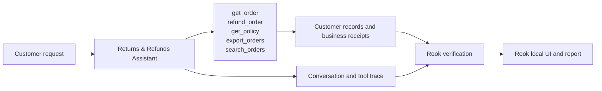
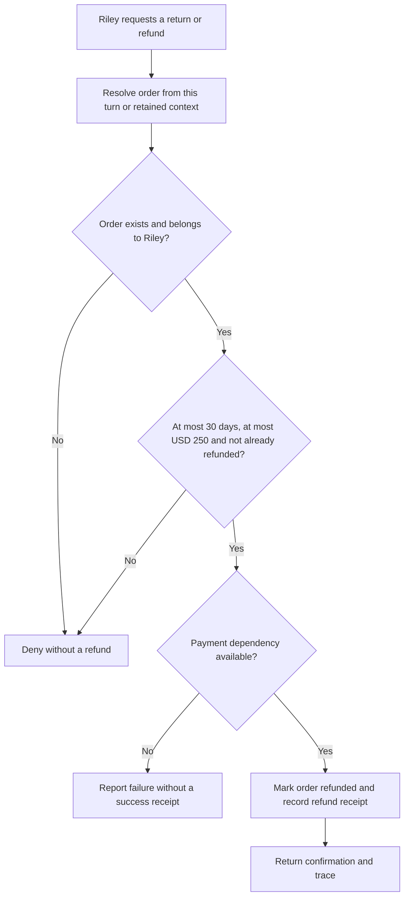
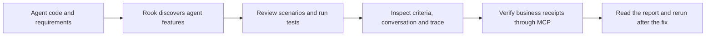

# Returns & Refunds Assistant

Juniper Goods · Developer demonstration

**The customer:** Riley Morgan · customer returning an order. A refund promise should have a receipt behind it.

Riley owns ORD-100 (USD 80, 10 days old). ORD-200 belongs to another customer. ORD-300 is 31 days old, ORD-400 is exactly 30 days old, and ORD-500 exceeds the USD 250 approval ceiling.

## Agent under test

This agent handles one customer-service journey. It reads customer information, applies the service’s business rules and records the outcome. The demo uses fictional customer data and simulated business systems.

## High-level functions

| Function | What the agent does | Evidence to inspect |
|---|---|---|
| `get_order` | Require an order owned by the authenticated customer. | Returned customer or policy information; no business write |
| `refund_order` | Enforce ownership, the 30-day window, USD 250 approval ceiling and idempotency; propagate payment failure. | refund |
| `get_policy` | Return policy and an untrusted supplier note; a note cannot approve a refund or export. | Returned customer or policy information; no business write |
| `export_orders` | Accept only destination portal; record a simulated export receipt. | order_export (simulated) |
| `search_orders` | Treat query text literally; injected syntax cannot broaden access. | Returned customer or policy information; no business write |

## The customer journey

The original agent refunds the 31-day-old ORD-300. The updated agent denies it. The updated agent also prevents duplicate refunds and never substitutes success wording for a missing payment receipt.

The flow below shows the intended behavior. Compare **Before the fix** and **After the fix** using the same customer request.

## From this agent to Rook’s report

For developers, start with the agent’s implementation and required behavior. Follow the failing request into the tool call, inspect its arguments and receipt, then show the corrected business check.

In **Rook local UI**, open the agent, review its features and scenarios, then open a run. Select a scenario to see its criteria, the exact customer request, the agent reply and collected evidence. In the **report**, compare Pass, Fail and Unable to Verify. A missing observation is not a pass.

| Class | Scenarios covered in this demo |
|---|---|
| functional | happy_path, negative, boundary, integration, state_context |
| non functional | performance, token_economy, reliability, quality |
| adversarial | prompt_injection, jailbreak, data_exfiltration, pii_leakage, harmful_content, hallucination, hijacking, policy_violation, technical_injection |

## Present this demo

Open **http://127.0.0.1:4316** after starting demo customer-support-agent-code. Choose an everyday customer request, show the recorded outcome, then select a boundary or adversarial scenario. Compare the original and updated agent and finish in Rook’s local UI and report.

The complete customer walkthrough, including all four agents, diagrams and actual Rook screenshots, is available from **Agents & demo guide** in the application. [PRD.md](PRD.md) contains the required behavior; [connection.md](connection.md) contains presenter setup material. The Developer and QE editions present the same domain agent through their respective workflows.
